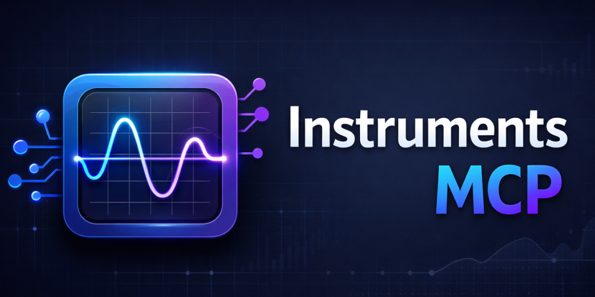

# InstrumentsMCP

<p align="center">
  
</p>

<p align="center">
  <a href="LICENSE"></a>
  <a href="https://nodejs.org"></a>
  <a href="https://modelcontextprotocol.io"></a>
</p>

**AI-native performance profiling for iOS and macOS apps.**

InstrumentsMCP gives AI agents the ability to profile your app using Xcode Instruments, understand the results, and suggest fixes — all without you opening Instruments once.

> "Profile my app for CPU hotspots" → structured JSON with severity ratings → AI suggests the fix

## The Problem

Xcode Instruments is powerful but produces massive, opaque XML trace exports that AI agents can't reason about. Developers end up manually profiling, interpreting flame graphs, and translating findings into code changes.

## The Solution

InstrumentsMCP wraps `xctrace` as an MCP server that **records, parses, classifies, and summarizes** Instruments traces into structured data any AI agent can act on.

- **Records** traces using any Instruments template
- **Parses** with template-specific heuristics (not generic XML dumping)
- **Classifies** by severity with domain-tuned thresholds
- **Summarizes** into actionable text an agent can reason about

## What You Can Profile

| Tool | What It Finds | Severity Thresholds |
|---|---|---|
| `profile_cpu` | CPU hotspots, main thread blockers, per-thread utilization | >15% self-time critical, >8% warning |
| `profile_swiftui` | Excessive view body re-evaluations, slow view rendering | >100 evals or >50ms critical |
| `profile_memory` | Memory by category, persistent vs transient, largest allocators | >50MB or >100k allocs critical |
| `profile_hitches` | Animation hangs with backtraces and duration classification | >1s critical, >250ms warning |
| `profile_launch` | App launch time, phase breakdown, cold/warm/resume detection | >1s cold critical, >500ms warm critical |
| `profile_energy` | Energy impact scores (0–20), per-component breakdown, thermal state | Avg ≥12 or peak ≥18 critical |
| `profile_leaks` | Leaked objects by type, sizes, responsible libraries | >100 leaks or >1MB critical |
| `profile_network` | HTTP traffic: request counts, durations, error rates, per-domain breakdown | >10% errors or >5s response critical |
| `performance_audit` | Combined CPU + Hitches + Leaks + Energy + Network health check | Worst severity across all five |
| `profile_raw` | Any template — raw table of contents for custom analysis | — |

## Quick Example

Ask your AI agent:

> "Profile my app for 5 seconds and tell me what's slow"

InstrumentsMCP returns:

```json
{
  "hotspots": [
    {
      "function": "FeedViewModel.loadItems()",
      "module": "MyApp",
      "selfPercent": 18.3,
      "totalPercent": 24.1,
      "severity": "critical"
    }
  ],
  "mainThreadBlockers": [
    {
      "function": "JSONDecoder.decode()",
      "durationMs": 34,
      "severity": "warning"
    }
  ],
  "summary": "Hottest function: FeedViewModel.loadItems() (18.3% CPU). 1 critical main-thread blocker found."
}
```

The agent reads this, understands the problem, and suggests moving `loadItems()` off the main thread.

## More Examples

<details>
<summary><b>SwiftUI View Performance</b></summary>

```json
{
  "template": "SwiftUI",
  "totalBodyEvaluations": 847,
  "excessiveEvaluations": [
    {
      "viewName": "FeedCardView",
      "evaluationCount": 156,
      "averageDurationUs": 420,
      "severity": "critical"
    }
  ],
  "summary": "847 total body evaluations across 23 views. 1 view with excessive re-evaluations: FeedCardView."
}
```

</details>

<details>
<summary><b>App Launch</b></summary>

```json
{
  "template": "App Launch",
  "totalLaunchMs": 1340,
  "launchType": "cold",
  "severity": "critical",
  "phases": [
    {
      "name": "Dynamic Library Loading",
      "durationMs": 580,
      "severity": "critical"
    },
    {
      "name": "UIKit Initialization",
      "durationMs": 310,
      "severity": "critical"
    },
    {
      "name": "Initial Frame Rendering",
      "durationMs": 290,
      "severity": "warning"
    }
  ],
  "summary": "App launch (cold): 1340ms — CRITICAL. Exceeds Apple's recommended launch time. Target: <400ms cold, <200ms warm. Slowest phases: Dynamic Library Loading (580ms), UIKit Initialization (310ms)."
}
```

</details>

<details>
<summary><b>Animation Hitches</b></summary>

```json
{
  "template": "Animation Hitches",
  "totalHangs": 3,
  "criticalHangs": 1,
  "warningHangs": 2,
  "summary": "3 hang events detected. 1 CRITICAL hang (>1s). 2 warning hangs (250ms-1s). Worst hang: 1240ms."
}
```

</details>

<details>
<summary><b>CPU Profiling (unsymbolicated)</b></summary>

When traces lack debug symbols, falls back to thread-level analysis:

```json
{
  "template": "Time Profiler",
  "totalSamples": 34,
  "threads": [
    {
      "name": "Main Thread 0x1ed4d4 (MyApp, pid: 98601)",
      "sampleCount": 12,
      "runningCount": 3,
      "blockedCount": 9,
      "utilizationPercent": 25
    }
  ],
  "summary": "34 CPU samples across 8 threads. Main thread: 25% active (3 running, 9 blocked).",
  "needsSymbolication": true
}
```

</details>

## All Tools

### Profiling

| Tool | Template | What it returns |
|---|---|---|
| `profile_cpu` | Time Profiler | Top CPU hotspots, main thread blockers, per-thread utilization |
| `profile_swiftui` | SwiftUI | View body evaluation counts, excessive re-renders, duration per view |
| `profile_memory` | Allocations | Memory usage by category, persistent vs transient, largest allocators |
| `profile_hitches` | Animation Hitches | Hang events by severity with backtraces |
| `profile_launch` | App Launch | Launch time, phases, cold/warm/resume classification |
| `profile_energy` | Energy Log | Energy impact scores, component breakdown, thermal state |
| `profile_leaks` | Leaks | Leaked objects by type, sizes, responsible libraries |
| `profile_network` | Network | HTTP request counts, durations, error rates, per-domain breakdown |
| `profile_raw` | Any | Raw table of contents for templates without a dedicated parser |
| `performance_audit` | CPU + Hitches + Leaks + Energy + Network | Combined 5-profile health check |

### Analysis

| Tool | What it does |
|---|---|
| `analyze_trace` | Export specific tables from existing `.trace` files by xpath |
| `symbolicate_trace` | Add debug symbols so function names appear instead of addresses |
| `performance_baseline` | Save, compare, list, or delete performance baselines for regression tracking |
| `performance_report` | Generate shareable Markdown performance reports from profile results |

### Discovery

| Tool | What it does |
|---|---|
| `instruments_status` | Check if `xctrace` is available and its version |
| `instruments_list_templates` | List all available profiling templates |
| `instruments_list_devices` | List connected devices and running simulators |
| `instruments_list_instruments` | List individual instruments |

## Setup

### Requirements

- macOS with Xcode installed (`xctrace` CLI)
- Node.js >= 20

### Install

```bash
git clone https://github.com/nicklama/InstrumentsMCP.git
cd InstrumentsMCP
npm install && npm run build
```

### Claude Code

Add to `.mcp.json`:

```json
{
  "mcpServers": {
    "instruments": {
      "command": "node",
      "args": ["/path/to/InstrumentsMCP/dist/index.js"]
    }
  }
}
```

### Cursor / Windsurf / Other MCP Clients

Same configuration — point to `dist/index.js` using your client's MCP server settings.

## Architecture

```
src/
├── index.ts              # MCP server entry point
├── tools/
│   ├── profile.ts        # Recording tools (cpu, swiftui, memory, hitches, launch, energy, leaks, network, raw)
│   ├── analyze.ts        # Trace analysis + symbolication + performance audit
│   ├── baseline.ts       # Baseline comparison + Markdown report generation
│   └── list.ts           # Discovery tools (status, templates, devices)
├── parsers/
│   ├── time-profiler.ts  # CPU hotspot extraction with caller aggregation
│   ├── swiftui.ts        # View body evaluation frequency analysis
│   ├── allocations.ts    # Memory allocation categorization
│   ├── hangs.ts          # Hang/hitch severity classification
│   ├── app-launch.ts     # App launch phase breakdown
│   ├── energy.ts         # Energy impact analysis
│   ├── leaks.ts          # Memory leak detection
│   └── network.ts        # HTTP traffic analysis
└── utils/
    ├── xctrace.ts        # xctrace CLI wrapper with retry logic
    ├── extractors.ts     # Shared XML row/field extractors
    └── xml.ts            # XML parsing (fast-xml-parser)
```

Each Instruments template has a dedicated parser with domain-specific heuristics. Severity thresholds are tuned per metric type. Traces are stored in `~/.instruments-mcp/traces/` for reuse and comparison.

## Compatibility

- Xcode Instruments (xctrace) 15.x through 26.x
- Handles xctrace 26 Deferred recording mode (automatic `time-sample` fallback)
- Retry logic for intermittent xctrace export failures

## License

MIT
