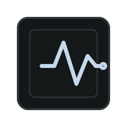

<p align="center">
  
</p>

<h1 align="center">InstrumentsMCP</h1>

<p align="center">
  <strong>Profiler data for agents.</strong>
</p>

<p align="center">
  <a href="https://www.npmjs.com/package/instrumentsmcp"></a>
  <a href="LICENSE"></a>
  <a href="https://nodejs.org"></a>
  <a href="https://modelcontextprotocol.io"></a>
</p>

MCP server that wraps Xcode Instruments. Record traces, automate the simulator, and return structured profiling data your coding agent can act on.

## Quick Start

**Requirements:** macOS, Xcode, Node.js >= 20

Add to your project's `.mcp.json`:

```json
{
  "mcpServers": {
    "instruments": {
      "command": "npx",
      "args": ["-y", "instrumentsmcp@latest"]
    }
  }
}
```

Or run directly: `npx instrumentsmcp@latest`

Works with Claude Code, Cursor, Windsurf, and any MCP client.

## What It Does

Ask your agent to profile. It records a trace, drives the simulator, and returns structured results:

```
=== Time Profiler ===  severity: [WARNING]  samples: 1587

Hotspots:
  UpdateStack::update() (AttributeGraph)  42.3ms self ━━━━━━╌╌╌╌╌╌╌╌╌ 12.1%
  FeedViewModel.loadItems() (MyApp)        28.1ms self ━━━━╌╌╌╌╌╌╌╌╌╌╌ 8.0%

Main thread blockers:
  [WARNING] FeedViewModel.loadItems()  28.1ms
```

35 tools across profiling, UI automation, simulator control, and trace analysis. [Full tool list →](docs/tools.md)

### Profiling

- **One-shot** — `profile_cpu`, `profile_swiftui`, `profile_memory`, `profile_hitches`, `profile_launch`, `profile_energy`, `profile_leaks`, `profile_network`
- **Scripted scenarios** — `profile_scenario` records a trace while executing UI steps (tap, scroll, type, launch)
- **Interactive** — `start_profiling` / `stop_profiling` for manual interaction
- **Health check** — `performance_audit` runs 5 templates and combines the results
- **Any template** — `profile_raw` handles templates without a dedicated parser

### UI Automation

Drive the simulator programmatically: `ui_tap`, `ui_type`, `ui_swipe`, `ui_gesture`, `ui_snapshot`, `ui_long_press`. Powered by [AXe CLI](https://github.com/cameroncooke/AXe) (`brew tap cameroncooke/axe && brew install axe`).

### Simulator Control

Launch/terminate apps, open deep links, push notifications, take screenshots, set location, toggle dark mode.

### Analysis

Re-analyze saved traces, drill into specific functions, track regressions with baselines, generate Markdown reports.

## CLI Mode

Record traces from the terminal without an MCP client:

```bash
npx instrumentsmcp record --process MyApp
npx instrumentsmcp record --process MyApp --template Allocations
```

Ctrl+C to stop. Feed the trace to your agent for analysis.

## Compatibility

- Xcode Instruments (xctrace) 15.x through 26.x
- Handles xctrace 26 Deferred recording mode automatically
- Device identifiers (`booted`, device name, UDID) resolved automatically

## Docs

- [Full tool reference](docs/tools.md)
- [Example output](docs/example-output.md)
- [Prepare your app for AI-driven profiling](docs/prepare-your-app.md)

<details>
<summary><b>Architecture</b></summary>

```
src/
├── index.ts              # MCP server entry + CLI router
├── cli.ts                # CLI mode (instrumentsmcp record)
├── tools/
│   ├── profile.ts        # One-shot profiling tools
│   ├── simulator.ts      # Simulator control + start/stop + scenarios
│   ├── analyze.ts        # Trace analysis + symbolication + audit
│   ├── baseline.ts       # Baseline comparison + report generation
│   ├── investigate.ts    # Drill-down + trace listing
│   ├── ui.ts             # UI automation (snapshot, tap, type, swipe)
│   └── list.ts           # Discovery tools (status, templates, devices)
├── parsers/              # Template-specific XML→JSON parsers
└── utils/                # xctrace, simctl, AXe wrappers + shared helpers
```

</details>

<details>
<summary><b>Build from source</b></summary>

```bash
git clone https://github.com/nemanjavlahovic/instruments-mcp-server.git
cd instruments-mcp-server
npm install && npm run build
```

Point your MCP client to `dist/index.js`.

</details>

## License

MIT
